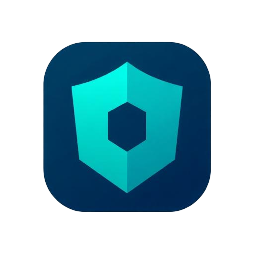

<div align="center">
  
  
  # 🌐 BLOCKID
  
  **Blockchain Based Identity Platform**
  
  <p align="center">
    <a href="https://react.dev/"></a>
    <a href="https://vitejs.dev/"></a>
    <a href="https://www.typescriptlang.org/"></a>
    <a href="https://polygon.technology/"></a>
  </p>

> _W3C Verifiable Credentials and Blockchain Based Identity platform anchored on the Polygon blockchain. Issue, hold, verify, and share credentials securely._

</div>

---

## 🚀 Overview

**BLOCKID** is a comprehensive **Web3 identity platform** designed to bring transparency, security, and true ownership to digital credentials. By leveraging the power of the **Polygon blockchain** and **W3C Verifiable Credentials standards**, BLOCKID establishes a trustless ecosystem where actors—Issuers, Holders, and Verifiers—can seamlessly interact with immutable, cryptographically verifiable records.

Whether for educational degrees, professional certifications, or IoT firmware registries, BLOCKID provides the decentralized foundation to securely manage digital identity and reputation. 🛡️

---

## ✨ Features

BLOCKID provides specialized dashboards and features for all participants in the credential ecosystem:

### 🏢 For Issuers

- 🖨️ **Credential Issuance:** Mint and issue cryptographically signed Verifiable Credentials directly to users.
- 🎛️ **Issuer Dashboard:** Manage your organization's decentralized identifier (DID) and track issued credentials.
- 🛑 **Revocation Management:** Securely revoke credentials on-chain when necessary.

### 👤 For Holders

- 💼 **Non-Custodial Wallet:** Store credentials securely in your own decentralized wallet interface.
- 🔐 **Selective Disclosure:** Share only the necessary data points through generated secure share links.
- 📲 **Seamless Sharing:** Generate QR codes or share links to effortlessly present credentials to verifiers.

### ✅ For Verifiers

- 🔍 **Zero-Knowledge Verification:** Instantly verify the authenticity, integrity, and validity of any presented credential without contacting the issuer.
- 📊 **Verifier Dashboard:** Centralized view to scan, review, and validate provided credentials.
- 🔒 **Tamper-Proof Assurance:** Cryptographic proof ensures that the data has not been altered since issuance.

### 🔗 Core Platform Capabilities

- 🌐 **Blockchain Explorer:** Dedicated in-app block explorer to monitor on-chain transactions and identity events.
- 📜 **Audit Log:** Comprehensive, immutable history of credential actions (issuance, sharing, verification) for compliance.
- 👥 **Role-Based Access Control:** Strict authorization ensuring users can only access their specific domain.
- 📱 **PWA Support:** Installable as a Progressive Web App for a native-like experience on desktop and mobile.

---

## 🛠️ Technology Stack

BLOCKID is built using a modern, scalable, and decentralized technology stack:

<div align="center">
  <table>
    <tr>
      <td align="center" width="50%">
        <h3>🎨 Frontend</h3>
        <b>Framework:</b> <a href="https://react.dev/">React 18</a> & <a href="https://vitejs.dev/">Vite</a><br>
        <b>Language:</b> <a href="https://www.typescriptlang.org/">TypeScript</a><br>
        <b>Styling:</b> <a href="https://tailwindcss.com/">Tailwind CSS</a><br>
        <b>UI Components:</b> <a href="https://ui.shadcn.com/">shadcn/ui</a>, <a href="https://www.radix-ui.com/">Radix UI</a>, <a href="https://www.framer.com/motion/">Framer Motion</a><br>
        <b>State & Data Fetching:</b> <a href="https://tanstack.com/query/v5">React Query</a>, <a href="https://react-hook-form.com/">React Hook Form</a>
      </td>
      <td align="center" width="50%">
        <h3>⚙️ Backend & Blockchain</h3>
        <b>Backend as a Service:</b> <a href="https://supabase.com/">Supabase</a> (Auth, Database, Storage)<br>
        <b>Blockchain Layer:</b> Polygon (EVM Compatible)<br>
        <b>Credential Standard:</b> W3C Verifiable Credentials
      </td>
    </tr>
  </table>
</div>

---

## 📦 Getting Started

### 📋 Prerequisites

Ensure you have the following installed on your local machine:

- 🟢 [Node.js](https://nodejs.org/) (v18+ recommended)
- 📦 [npm](https://www.npmjs.com/) or yarn / pnpm

### 🛠️ Installation

1. **Clone the repository:**

   ```bash
   git clone https://github.com/SINISTERgg/block-id.git
   cd block-id
   ```

2. **Install dependencies:**

   ```bash
   npm install
   ```

3. **Environment Setup:**
   Create a `.env` file in the root directory and configure the necessary variables (e.g., Supabase credentials, Polygon RPC details).

   ```env
   VITE_SUPABASE_URL=your_supabase_url
   VITE_SUPABASE_ANON_KEY=your_supabase_anon_key
   ```

4. **Start the development server:**

   ```bash
   npm run dev
   ```

5. **Build for production:**

   ```bash
   npm run build
   ```

---

## 📁 Project Structure

```text
block-id/
├── public/              # 🌐 Static assets (icons, manifest)
├── src/
│   ├── components/      # 🧩 Reusable UI components & Layouts
│   ├── hooks/           # 🪝 Custom React hooks (e.g., useAuth)
│   ├── lib/             # 🛠️ Utility functions
│   ├── pages/           # 📄 Application views/routes
│   │   ├── holder/      # 💼 Holder wallet specific pages
│   │   ├── issuer/      # 🏢 Issuer dashboard pages
│   │   ├── verifier/    # ✅ Verifier specific pages
│   │   └── ...          # 🔐 Auth, Landing, Explorer, Audit pages
│   ├── App.tsx          # 🔀 Main application routing
│   └── main.tsx         # 🚀 Application entry point
├── package.json         # 📦 Project dependencies and scripts
├── tailwind.config.ts   # 🎨 Tailwind CSS configuration
├── vite.config.ts       # ⚡ Vite bundler configuration
└── README.md            # 📖 This documentation file
```

---

## 🛡️ License

This project is licensed under the **MIT License** - see the LICENSE file for details.

---

## 🤝 Contributing

Contributions, issues, and feature requests are welcome! Feel free to check the issues page.

---

<p align="center">
  <i>Built By Hoysala Sathyanarayana</i>
</p>
